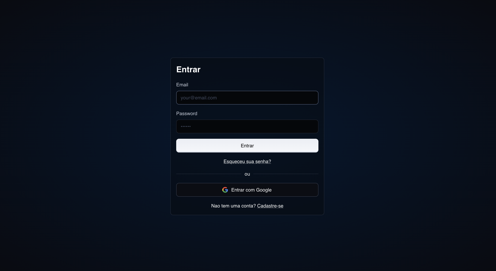
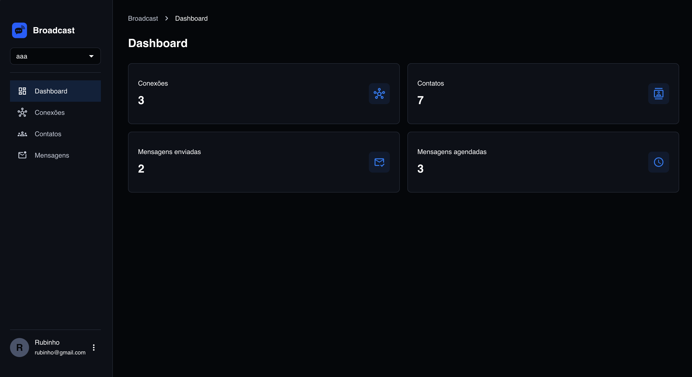
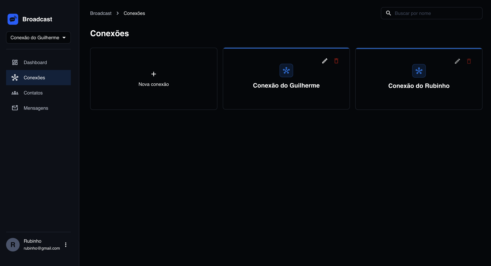
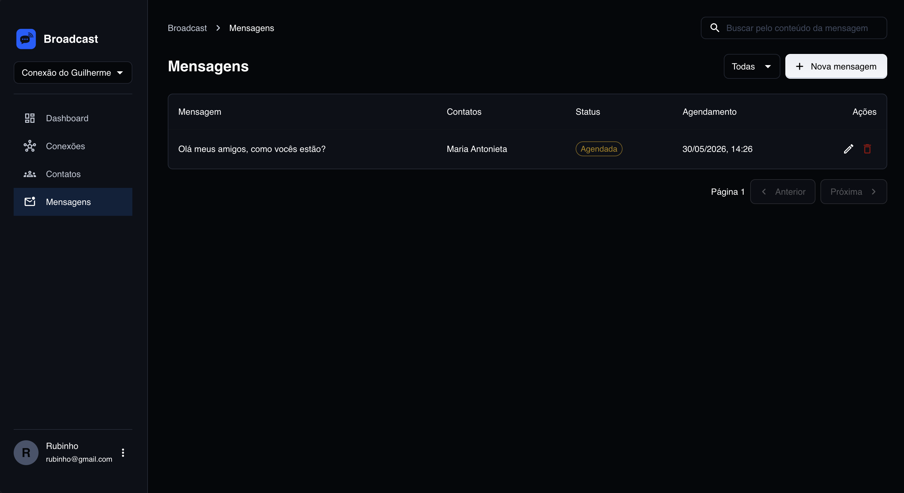

# Broadcast

App para organizar contatos por conexão e disparar mensagens — na hora ou agendadas. A ideia é simples: você cria uma conexão (ex.: um número/origem), cadastra os contatos dela e dispara mensagens para um ou vários de uma vez, com a opção de agendar para depois.

Feito com React + Firebase, hospedado no Firebase Hosting.

🔗 **Online:** https://broadcast-app-62350.web.app

## Telas

### Login
Entrar com e-mail/senha ou conta Google.



### Dashboard
Um panorama rápido: conexões, contatos e mensagens (enviadas e agendadas).



### Conexões
Cada conexão é um "espaço" próprio de contatos e mensagens.



### Mensagens
Lista com status, busca pelo conteúdo e paginação. Dá pra enviar na hora ou agendar.



## O que dá pra fazer

- Login por e-mail/senha e Google
- CRUD de conexões
- CRUD de contatos, com busca por nome/telefone e paginação
- Criar mensagens para vários contatos, enviar na hora ou agendar
- Busca de mensagens pelo conteúdo + filtro por status (todas / enviadas / agendadas)
- Disparo das mensagens agendadas roda sozinho via Cloud Function (cron de 1 em 1 minuto)

## Stack

- **Front:** React 19, TypeScript, Vite, MUI + Tailwind, React Router, React Hook Form + Zod
- **Backend:** Firebase Auth, Cloud Firestore e Cloud Functions
- **Testes:** Vitest (unitários) e Cypress (e2e)
- **Deploy:** Firebase Hosting com CI/CD no GitHub Actions

## Rodando localmente

Precisa de Node 22+, pnpm e um projeto Firebase.

```bash
cd web
pnpm install
```

Crie um `web/.env.local` com as credenciais do seu Firebase:

```
VITE_FIREBASE_API_KEY=...
VITE_FIREBASE_AUTH_DOMAIN=...
VITE_FIREBASE_PROJECT_ID=...
VITE_FIREBASE_STORAGE_BUCKET=...
VITE_FIREBASE_MESSAGING_SENDER_ID=...
VITE_FIREBASE_APP_ID=...
```

Suba o app (porta 5173):

```bash
pnpm dev
```

## Testes

**Unitários** (Vitest):

```bash
cd web
pnpm test
```

**End-to-end** (Cypress) — o app precisa estar rodando em outra aba (`pnpm dev`):

```bash
cd web
pnpm test:e2e
```

O `test:e2e` já cria o usuário de teste no Firebase (ignora se já existir) e avisa caso o app não esteja no ar.

## Deploy

O hosting já está publicado. A cada push na `main`, o GitHub Actions roda os testes unitários e, se passarem, publica o hosting e as regras/índices do Firestore.

Para publicar na mão:

```bash
cd web && pnpm build
firebase deploy --only hosting,firestore
```

## Estrutura

```
web/        front-end (React + Vite)
functions/  Cloud Functions (disparo de mensagens agendadas)
```
